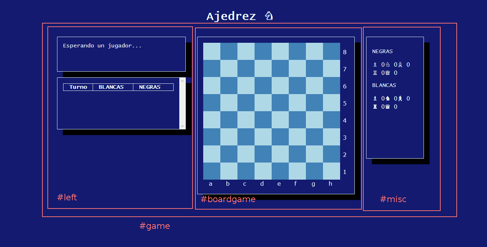

# Juego multijugador en línea: ajedrez

## Introducción

El objetivo es hacer un juego de ajedrez en línea. Es un juego pausado, por turnos, haciendo fácil de sincronizar entre hosts.

Para el proyecto consta de dos host clientes conectados a un servidor, que puede estar alojado en una máquina remota para permitir partidas a través de Internet, o estar alojado en una máquina de una LAN.


Solamente se requiere de un navegador web de parte del cliente para jugar en línea.
## Lado Cliente

El lado cliente es un navegador web en su última versión (recomendable) disponible donde corre una aplicación escrita en HTML5, JavaScript y CSS3. Se usa WebSockets para enviar y recibir datos del servidor.

No se ha usado ningún framework de JavaScript. El motivo es que da más libertad a la hora de cómo organizar y escribir el código, además de ser más rápido de ejecutar.

Cada elemento de la aplicación como el historial, el tablero o los mensajes... son clases que se instancian como objetos globales.

Dos constantes está disponibles de forma global que son definidas en el momento de ofrecer la aplicación al cliente. **HOST**, con la dirección IP del servidor y **PORT**, donde se indica el puerto del servidor. Estas dos variables son necesarias para crear un websocket para comunicarse con el servidor. Para hacer esto la página web a servir es una plantilla Jinja2 con la siguiente parte:

```jinja2
<!-- ... -->
<script>
  const HOST = "{{ host }}";
  const PORT = "{{ port }}";
  // ...
</script>
<!-- ... -->
```
## Lado Servidor

El lado servidor es un servidor web escrito en Python3. La versión de Python3.5 o superior es necesario para hacer correr el servidor. Hace uso de las nuevas palabras claves **async** y **await** para la programación asíncrona con *asyncio*, un módulo de biblioteca estándard de Python que permite la programación asíncrona.

Python es un lenguaje fácil de usar pero no está pensado para la programación asíncrona que involucra operaciones de entrada y salida. Para servir aplicaciones web de forma asíncrona hace uso de *aiohttp*, construida por encima de *asyncio* y además ofrece soporte para gestionar conexiones de websockets sin necesidad de retrollamadas (callbacks) como pasa con nodejs.

La página web está escrita como una plantilla de Jinja2, así que el módulo *aiohttp-jinja2* también es usado para dar soporte a la plantillas jinja2 con *aiohttp*.

Para controlar las partidas de ajedrez hace uso del módulo *python-chess* que valida los movimientos enviados desde los clientes, y puede generar listas de movimientos legales de cada una de las piezas de un jugador.

La aplicación consiste en un script de entrada y un paquete específico para el servidor web llamado *chessasir*. Desde el script de entrada se sirve a los cliente el contenido de *chess-client*.

La dirección IP y el puerto del servidor se puede configurar desde la línea de comandos. Por defecto la IP del servidor se adopta desde la última interfaz de red detectada que no sea localhost.

## Protocolos y la red

### Red

El modelo de red escogido es del **cliente-servidor**. Es más directo de implementar que un modelo par-a-par, separa claramente la funcionalidades de cada lado haciéndolo más fácil de mantener y hace más difícil de hacer trampas porque el servidor es autoritativo. En contra, es más costoso de desplegar y si el servidor cae el resto de los clientes conectados al servidor también caen.

Tanto el cliente como el servidor hace uso de websockets. Los websockets son un canal de comunicación bidireccional y full-duplex que permite ser usado en navegadores web y servidores que lo soporten para comunicarse entre sí con TCP. Los clientes nunca se comunican entre sí, solo a través del servidor.

### Protocolo

El formato del protocolo es JSON, basado en texto. JSON es fácil de manejar en el lado cliente que usa JavaScript y en el lado del servidor con Python y aiohttp. JSON se transmite codificado en UTF-8, que por defecto es lo que los navegadores web y los servidores usan.

Todos los mensajes que se transmiten tienen el miembro **command** que almacena como cadena en mayúsculas el comando que se quiere realizar. Dependiendo el comando habrá miembros adicionales.

Ejemplos:

```json
{"command": "STARTGAME", "color": "WHITE"}
{"command": "ACCEPTRESTART"}
{"command": "SENDMOVE", "color": "BLACK", "to": "b3", "from": "b2", "fromXY": {"x": 1, "y": 1}, "toXY": {"x": 1, "y": 2}}
```

El protocolo usa algunos términos que son estos

+ **fen**: Es una notación estándard para describir una posición particular de una partida de ajedrez. Da la información necesaria para reempezar una partida de ajedrez desde un momento en particular.
+ **san**: Es una notación para registrar y describir movimientos en una partida de ajedrez.
+ **ep**: **En passant** (al paso) Es un movimiento de ajedrez que puede hacerse justo después de que un peón adelanta dos casillas y se sitúa al lado de un peón rival. Este peón rival puede entonces capturar al peón como si hubiese adelantado solo una casilla sólo en su próximo turno.

| Comando        | Parámetros                                                   | Destinatario                   | Información                                                  |
| -------------- | ------------------------------------------------------------ | ------------------------------ | ------------------------------------------------------------ |
| PLAYERJOINED   |                                                              | Servidor -> Cliente            | Indica a otro cliente que un jugador se ha unido a la partida. |
| PLAYERQUITS    |                                                              | Servidor -> Cliente            | Indica a otro cliente que un jugador se ha quitado de la partida. |
| REQUESTWHITE   |                                                              | Cliente -> Servidor            | Un jugador solicita empezar la partida como las BLANCAS.     |
| STARTGAME      | **color**: ("WHITE" \| "BLACK")                              | Servidor -> Clientes           | El servidor indica que ha empezado la partida y envía el color asignado a los clientes. |
| SENDMOVE       | **from**: coordenadas , **to**: coordenadas, **color**: ("WHITE" \| "BLACK"), **fromXY**: {x: columna del tablero, y: fila del tablero}, **toXY**: {x: columna del tablero, y: fila del tablero} | Cliente -> Servidor            | Un jugador envía un movimiento al servidor.                  |
| OKMOVE         | **color**: ("WHITE" \| "BLACK"), **san**: san, **fen**: fen, **turn**: turno actual, **ep**: si está al paso (true, false), **result**: Si el juego acaba, indicar el resultado para **color**, **reason**: Razón del resultado (jaque mate, ahogamiento...). | Servidor -> Cliente            | Indica al cliente que envió SENDMOVE que el movimiento está bien con el nuevo estado del tablero indicado en **fen**. |
| PLAYERMOVE     | **color**: ("WHITE" \| "BLACK"), **san**: san, **fen**: fen, **turn**: turno actual, **from**: {x: columna del tablero, y: fila del tablero}, **to**: {x: columna del tablero, y: fila del tablero}, **ep**: si está al paso (true, false), **moves**: lista de movimiento legales para cada una de las piezas del otro jugador, **result**: Si el juego acaba, indicar el resultado para **color**, **reason**: Razón del resultado (jaque mate, ahogamiento...). | Servidor -> Cliente            | Indica al otro cliente del que envió SENDMOVE que el rival ha hecho un movimiento y le toca su turno. |
| REQUESTRESTART |                                                              | Cliente -> Servidor -> Cliente | El jugador solicita reempezar la partida como las blancas al otro jugador. |
| REJECTRESTART  |                                                              | Cliente -> Servidor -> Cliente | El jugador indica al otro jugador que rechaza reempazar la partida como blancas. |
| ACCEPTRESTART  |                                                              | Cliente -> Servidor            | El jugador acepta dejar reempezar la partida siendo su rival las blancas. |


## Aspectos de presentación

### Servidor

El servidor usa una interfaz para linea de comandos. Se configura con parámetros desde una terminal.

### Cliente

El cliente al ser un navegador web usa una hoja de estilos proporcionado desde el servidor. El tablero de ajedrez se dibuja usando la etiqueta **canvas** y JavaScript. En el proyecto el tablero está encapsulado en una clase *BoardViewer* que maneja un elemento **canvas**.

## Problemática

## Conclusiones

Para aprender a hacer juegos en línea, juegos de ritmo lento como el ajedrez o el tres en raya es una buena forma de empezar. Se aprende a diseñar e interpretar un protocolo. Además no tienes muchos problemas de sincronización entre el servidor y los clientes.

Una aplicación web permite el juego en línea en cualquier medio con un navegador web con soporte a JavaScript, WebSockets y el elemento **canvas**.

## Mejoras

+ Poder entrar en una sala bajo un nick y crear una partida.
+ Hacer correr el servidor web a través Apache o Nginx, ya que no es seguro servir los contenidos estáticos (js, html, css) a través de la aplicación web.
+ Guardar y restaurar partidas. Ya esto requiere registro de usuarios.
+ Ofrecer una versión adaptada a los móviles. Ahora mismo está diseñado pensado para el escritorio.
+ Una IA al lado del servidor para partidas remotas contra la máquina. El servidor web tendría que comunicarse con un motor de ajedrez como GNU Chess y enviar los resultados de vuelta al cliente.